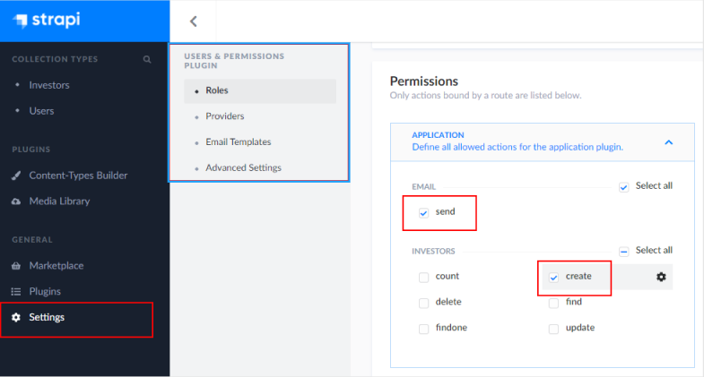

### How to run the application

## Backend

1. Open a terminal, navigate to the 'server' folder in this project.
2. Create a '.env' file, and paste your sendgrid API key in there: SENDGRID_API_KEY=yourKey. In the same file set the email address to send emails from: SENDGRID_SEND_FROM=your@address.com.
3. Run 'npm install' in your terminal.
4. Run 'npm run strapi develop' in your terminal.
5. Register on admin UI when strapi windows opens up.
6. Go to 'SETTINGS' -> 'USERS & PERMISSIONS PLUGIN' -> 'ROLES' -> 'PUBLIC'. Select 'send' and 'create' actions in the application plugin:
   

Don't forget to save your selection!

## Frontend

1. Open a terminal, navigate to the 'client' folder in this project.
2. Run 'npm install' in your terminal.
3. Run 'npm start' in your terminal.

Go to http://localhost:3000/ to use the application.
